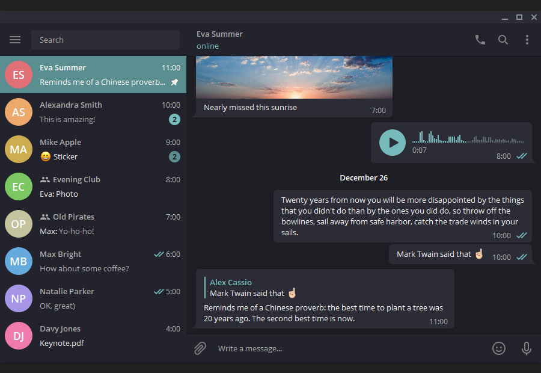
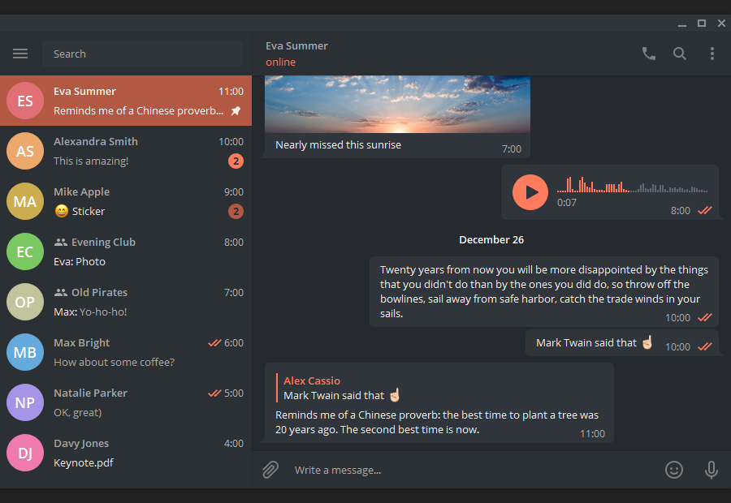

   
  
  

**[This theme for Telegram Web](https://github.com/VChet/Telegram-Vanilla-Dark-Web)**

## Preview

___

___

___

## Development
1. [Fork](https://github.com/VChet/Telegram-Vanilla-Dark/fork) and download this repository.
1. Install [Node.js](https://nodejs.org/).
1. Add or change constants in [mappings](mappings.js).
1. Change colors in one of the [theme files](./themes/).
1. Generate theme with `npm run generate <theme-name>`.
1. Commit and push your changes.
1. Make a pull request.
